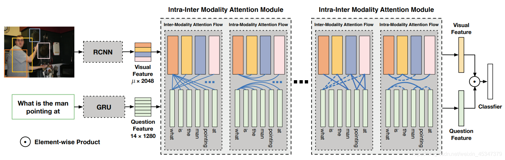

# -DFAFmodel-
来自论文：Dynamic Fusion with Intra- and Inter-modality Attention Flow for Visual Question Answering 
原始代码链接：https://github.com/bupt-cist/DFAF-for-VQA.pytorch 
函数功能：模块内模块外的注意力融合。  
具体来说，在模态间和模态内使用的都是自注意机制，但是模态间是图像和问题互相引导；模态内是单词受区域影响地引导单词，图像受区域影响地引导图像。 

  

- class Net                          # 接收参数并调用其他类和函数

- class Fusion                       # 没有用到
- class ReshapeBatchNorm(nn.Module): # 没有用到

- class Classifier(nn.Sequential):   # 用于最后的分类
- class SingleBlock(nn.Module):      # 单个的模块（是论文中的那种）【Inter-Intra】【Inter-Intra】……【Inter-Intra】

- class MultiBlock(nn.Module):       # 多个模块，没有用到，【Inter-……-Inter】 【Intra-……Intra】……

- class InterModalityUpdate(nn.Module):    # 模块间的融合，使用自注意，每一个单词与每个区域互相引导
- class DyIntraModalityUpdate(nn.Module):  # 模块内的动态融合，单词自注意时受区域的影响，区域自注意时受单词的影响

#### 说明
部分没有用到是因为，作者的代码也是在别人的代码基础上改的。https://github.com/Cyanogenoid/vqa-counting/tree/master/vqa-v2

